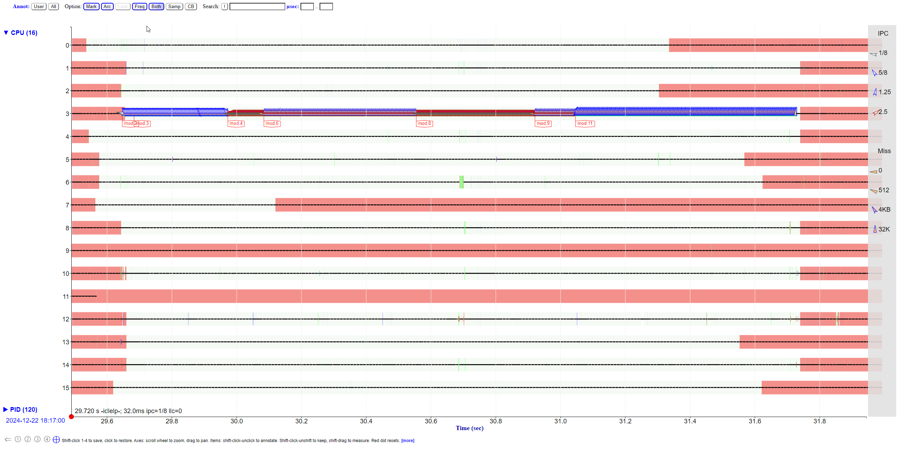
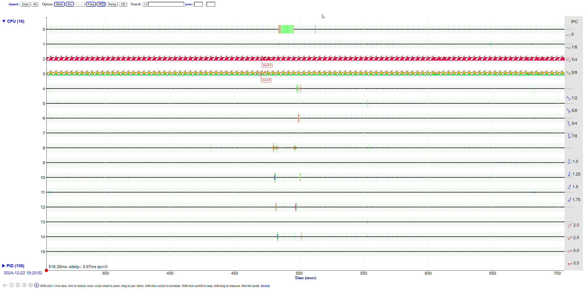
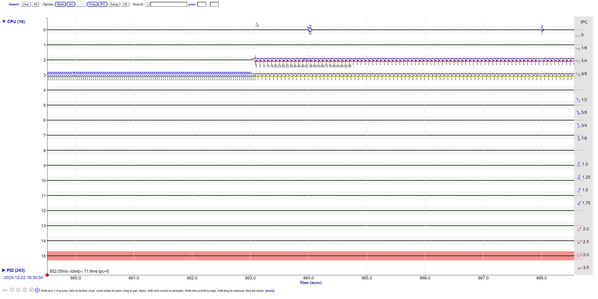
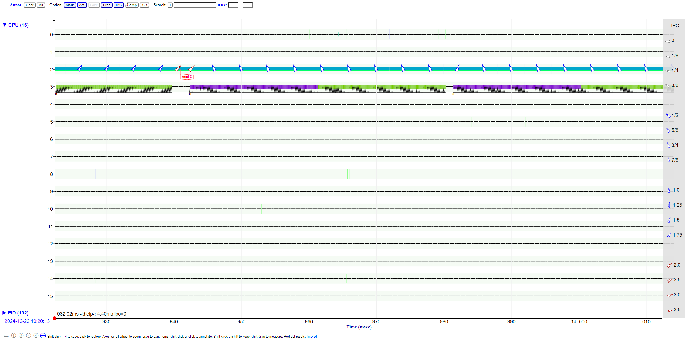
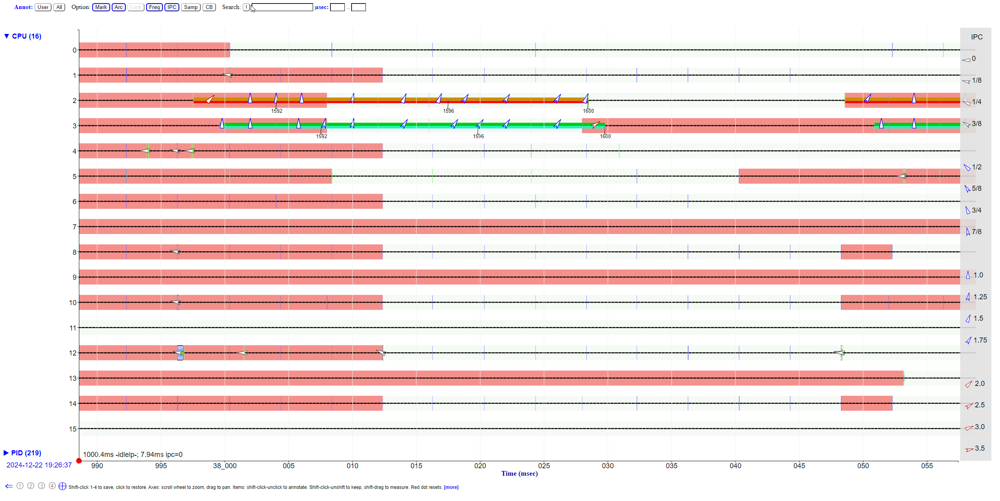

# Difffernet profiling tools

```
taskset -c 2,3 ./whetstone_ku 300000


taskset -c 2 ./whetstone_ku 300000 &
taskset -c 3 ./whetstone_ku 300000 &


taskset -c 2 ./flt_hog &
taskset -c 3 ./flt_hog &

taskset -c 2 ./whetstone_ku 300000 &
taskset -c 3 ./flt_hog &

taskset -c 2 ./memhog_ram 20 &
taskset -c 3 ./memhog_ram 21 &

```




IPC lowers from 2.5 to 2



IPC lowers from 1/2 to 1/4 when two running same core




mod 8 ipc -> 3 to 3/4



2 IPC -> 1.25 - 1.75

This is not a good benchmark (whetstone), because much of the fraction of time spent is uneven, others saturate resources, but for other reasons (memory, and compiler optimziation)

Test things against itself (because it shows that it may use more than its share of a resource)
