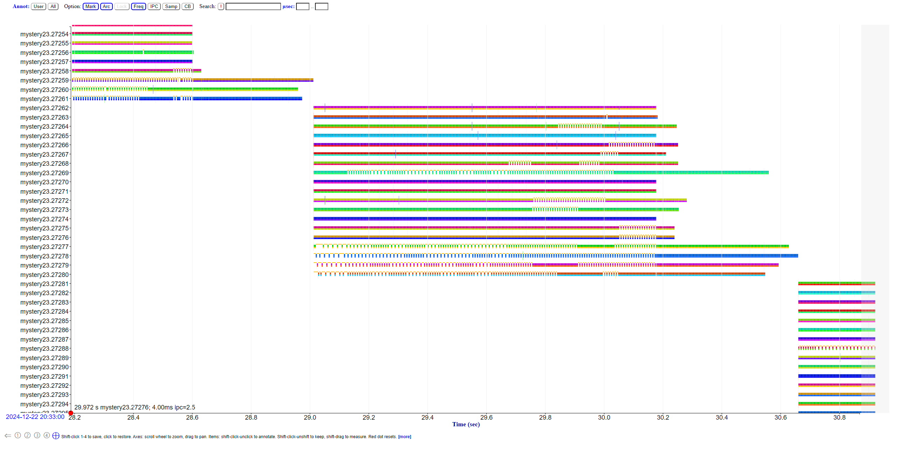
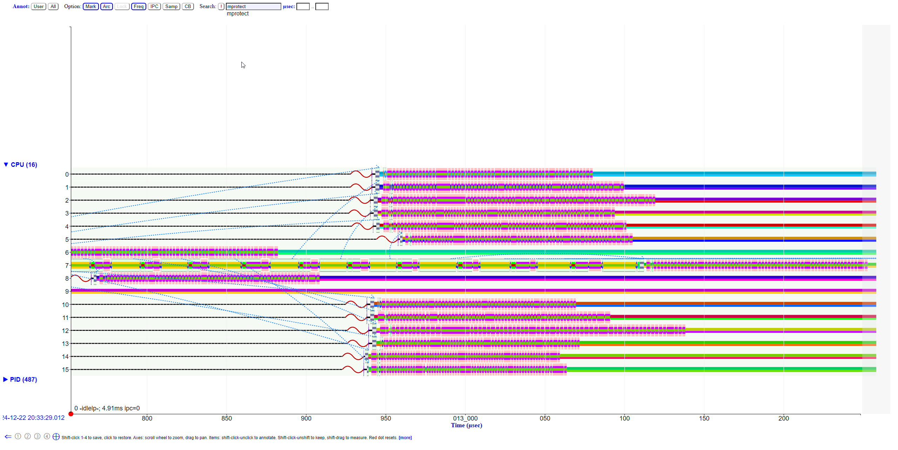

# Difffernet profiling tools

```
./mystery23

```



Not equal slices for cfs



cloning takes time.


1s versus 850ms

IPC lowers from 2.5 to 2


IPC lowers from 1/2 to 1/4 when two running same core


mod 8 ipc -> 3 to 3/4


2 IPC -> 1.25 - 1.75

This is not a good benchmark (whetstone), because much of the fraction of time spent is uneven, others saturate resources, but for other reasons (memory, and compiler optimziation)

Test things against itself (because it shows that it may use more than its share of a resource)
