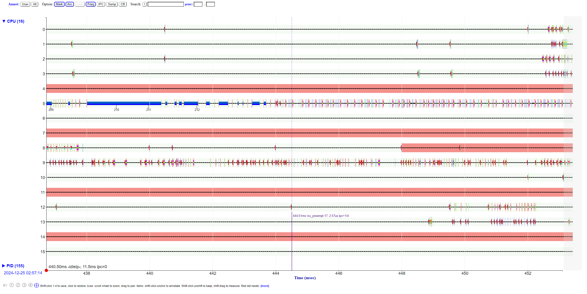
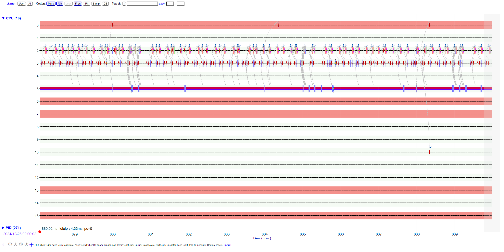

# Difffernet profiling tools

```
./mystery23

```



Goes from blue to red, notice that it's still page faulting, but now with starting to slow down with paging?


kswapd kicks in (bottom)



Gray lines indicate disk scans. Not sure how grouped they are
