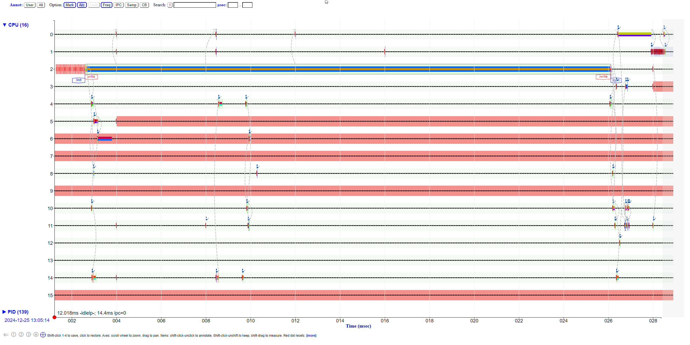

# Difffernet profiling tools

```
./mystery23

```



Goes from blue to red, notice that it's still page faulting, but now with starting to slow down with paging?


```
opening test1.bin for write
  write:      40.00MB  0.023sec 1714.02 MB/sec
  sync:       40.00MB  0.039sec 1028.38 MB/sec
  read:       40.00MB  0.012sec 3436.72 MB/sec
  seq read:   40.00MB  0.252sec 158.72 MB/sec
  rand read:  40.00MB  0.740sec  54.06 MB/sec

opening test2.bin for write
opening test1.bin for write
  write:      40.00MB  0.024sec 1684.85 MB/sec
  write:      40.00MB  0.024sec 1679.26 MB/sec
  sync:       40.00MB  0.047sec 842.64 MB/sec
  sync:       40.00MB  0.047sec 843.63 MB/sec
  read:       40.00MB  0.035sec 1149.06 MB/sec
  read:       40.00MB  0.036sec 1107.51 MB/sec
  seq read:   40.00MB  0.728sec  54.95 MB/sec
  seq read:   40.00MB  0.730sec  54.82 MB/sec
  rand read:  40.00MB  0.757sec  52.85 MB/sec
  rand read:  40.00MB  0.774sec  51.66 MB/se
```
