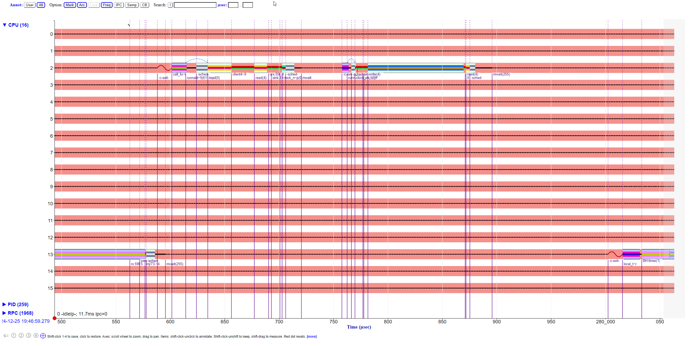
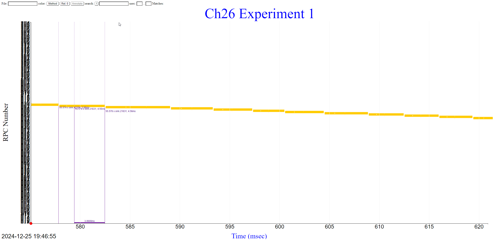
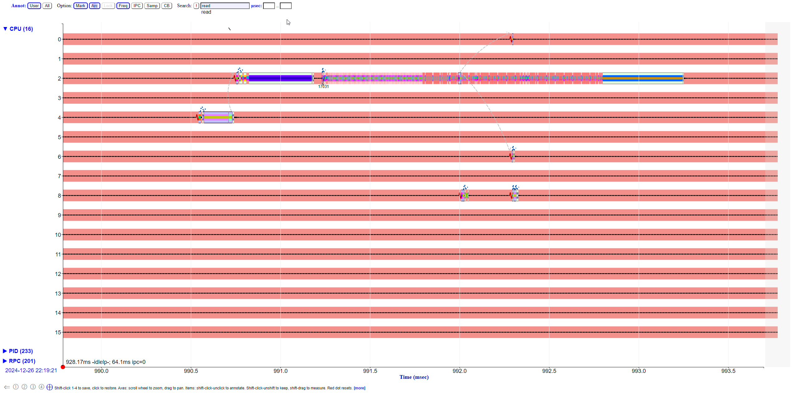
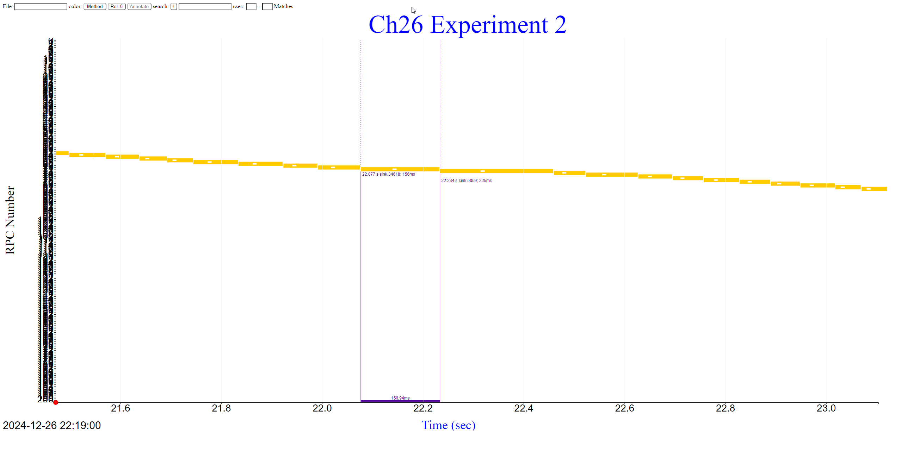

# Difffernet profiling tools

```
./mystery23

```






Goes from blue to red, notice that it's still page faulting, but now with starting to slow down with paging?


```
taskset -c 2 ./client4 192.168.50.233 12345 -rep 2000 sink -key "abcd" + -value "vvvv" + 4000
taskset -c 2 ./client4 192.168.50.233 12345 quit

./timealign client4_2024*
./dumplogfile4 "Ch26 Experiment 1" client4_2024*_align.log > ch26_exp1.json
export LC_ALL=C
cat ch26_exp1.json | sort | ./makeself show_rpc.html > ch26_exp1.html

taskset -c 2 ./client4 192.168.50.233 12345 -rep 20 sink -key "abcd" + -value "vvvv" + 1000000
taskset -c 2 ./client4 192.168.50.233 12345 quit

./timealign client4_2024*
./dumplogfile4 "Ch26 Experiment 2" client4_2024*_align.log > ch26_exp2.json
export LC_ALL=C
cat ch26_exp2.json | sort | ./makeself show_rpc.html > ch26_exp2.html


Histogram of floor log 2 buckets of usec response times
1 2+ 4+ us            1+ 2+ 4+ msec         1+ 2+ 4+ sec           1K+ 2k+ secs
|                     |                     |                      |
0 0 0 0 0 0 0 0 0 0   0 0 0 0 0 67 131 2 0 0   0 0 0 0 0 0 0 0 0 0   0 0 
200 RPCs, 14672.8 msec, 200.020 TxMB, 0.018 RxMB total
 13.6 RPC/s (73.364 msec/RPC),  13.6 TxMB/s,   0.0 RxMB/s

```

about 16MB/s on wifi


