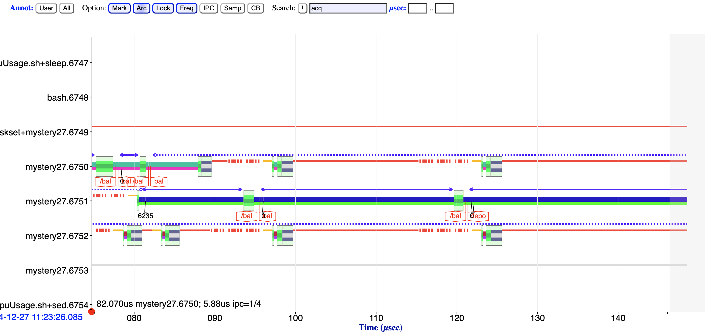
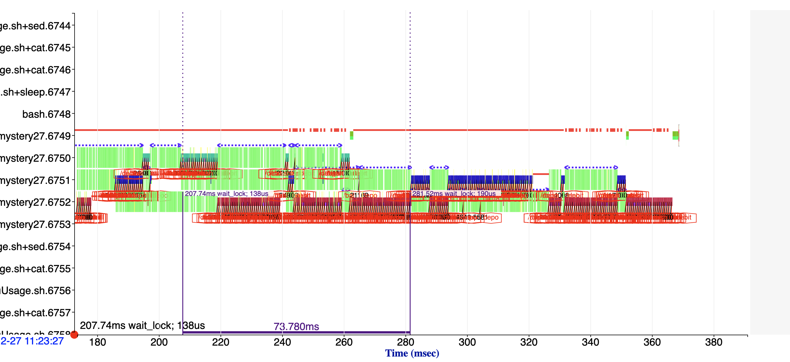
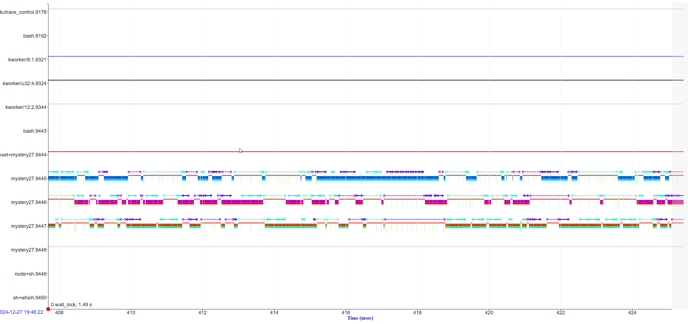
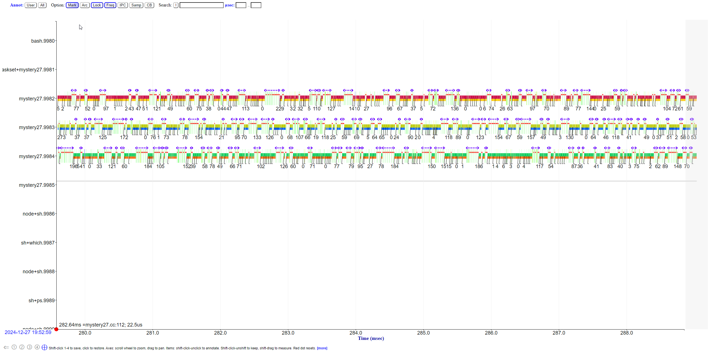
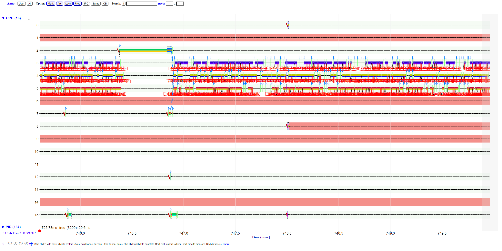
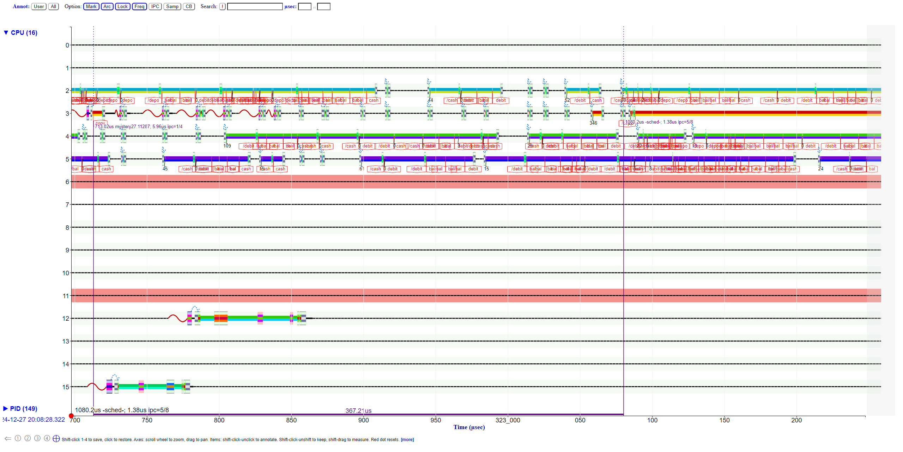

# Difffernet profiling tools


```
 1us 10 100    1ms 10 100    1s 10
 [410 0 57   272 184 0   0 0 ] sum = 923
  Minimum       0 us
  Maximum   60625 us
  90th %ile 23750 us
  Expected     49 us
```




Lock is locked again after it's gotten to thread



Starvation of ~60ms

```
 taskset -c 2,3,4,5 ./mystery27 -nocapture

[mystery27.cc:112] ERROR: 90%ile > EXPECTED
  1us 10 100    1ms 10 100    1s 10
 [1493 10852 16566   47 0 0   0 0 ] sum = 28958
  Minimum       0 us
  Maximum    1625 us
  90th %ile   650 us
  Expected     49 us
```


```
 taskset -c 2,3,4,5 ./mystery27 -multilock

[mystery27.cc:121] zero entries
[mystery27.cc:120] ERROR: 90%ile > EXPECTED
  1us 10 100    1ms 10 100    1s 10
 [433 1780 2877   88 0 0   0 0 ] sum = 5178
  Minimum       0 us
  Maximum    3188 us
  90th %ile   700 us
  Expected     49 us
[mystery27.cc:116] zero entries
[mystery27.cc:112] ERROR: 90%ile > EXPECTED
  1us 10 100    1ms 10 100    1s 10
 [449 1608 3285   83 0 0   0 0 ] sum = 5425
  Minimum       0 us
  Maximum    3375 us
  90th %ile   700 us
  Expected     49 us
```




```
 taskset -c 2,3,4,5 ./mystery27 -nolockbal -smallwork

[mystery27.cc:112] ERROR: 90%ile > EXPECTED
  1us 10 100    1ms 10 100    1s 10
 [1815 3278 672   0 0 0   0 0 ] sum = 5765
  Minimum       0 us
  Maximum     806 us
  90th %ile   131 us
  Expected     49 us

```



```
taskset -c 2,3,4,5 ./mystery27 -nolockbal -smallwork -multilock -dash1

[mystery27.cc:120] ERROR: 90%ile > EXPECTED
  1us 10 100    1ms 10 100    1s 10
 [748 1300 70   0 0 0   0 0 ] sum = 2118
  Minimum       0 us
  Maximum     563 us
  90th %ile    75 us
  Expected     49 us
[mystery27.cc:116] zero entries
[mystery27.cc:112] ERROR: 90%ile > EXPECTED
  1us 10 100    1ms 10 100    1s 10
 [842 1451 19   0 0 0   0 0 ] sum = 2312
  Minimum       0 us
  Maximum     606 us
  90th %ile    70 us
  Expected     49 us

```



