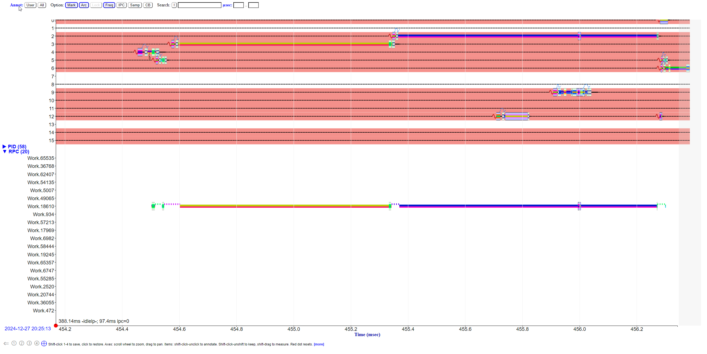
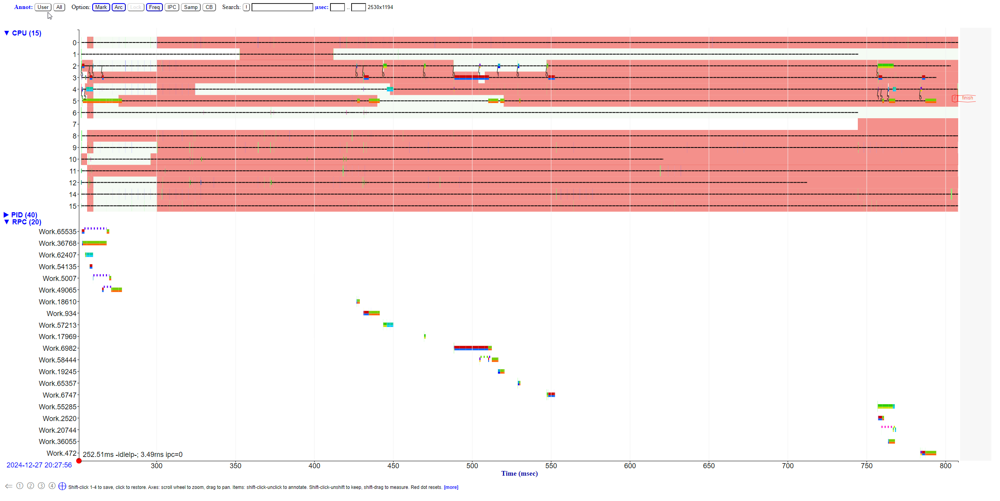
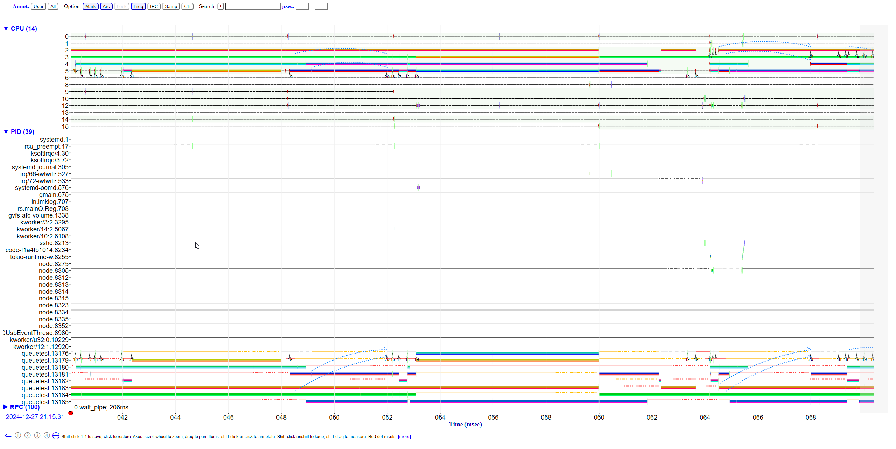
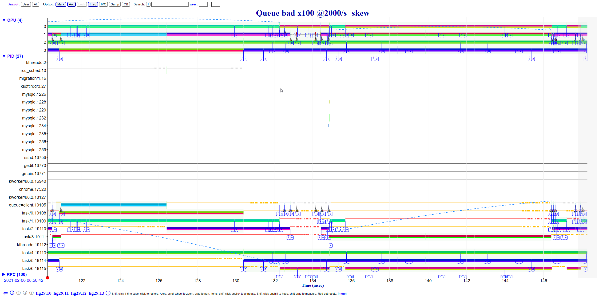
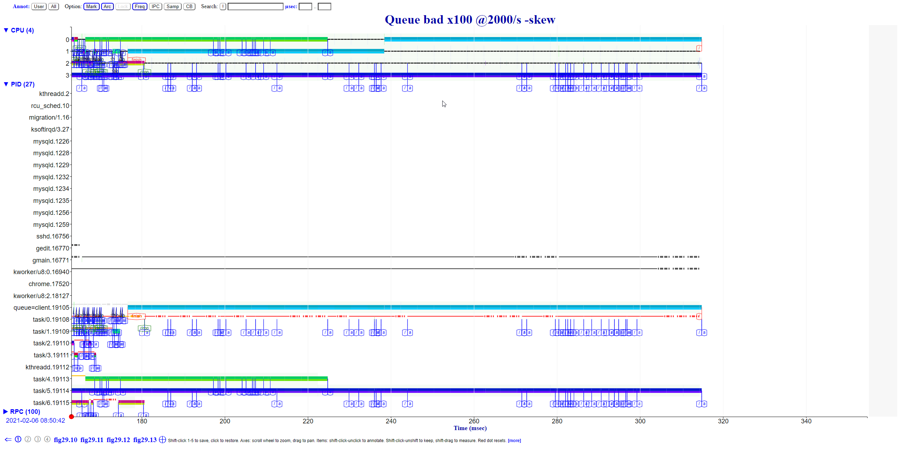
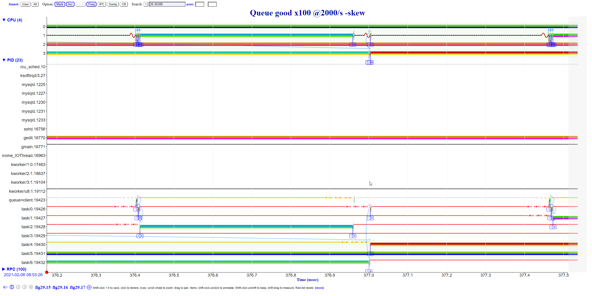

# Difffernet profiling tools


```
taskset -c 2,3,4,5 ./queuetest -n 20 -rate 50
```




```
taskset -c 2,3,4,5 ./queuetest -n 20 -rate 50 -skew
Delays (usec), total = 43252, average = 432
Transactions (usec), total = 4518270, average = 45182

```



100 transactions, 14 dropped

Delays (usec), total = 43252, average = 432
Transactions (usec), total = 4006498, average = 40064
```
taskset -c 2,3,4,5 ./queuetest -n 100 -rate 2000 -skew -s

```

29.1 Explain the large delays between times 42.120 and 42.145 in trace queuetest_bad_20210206_085042_dclab-2_19105_q.html.



Take a look at task/4, task/5, task/6. These are takingup much of the timefrom 130 -> 145.

29.2 Why are there longer RPC queuing delays in last half of trace qt_20210206_085042_dclab-2_19105.html?



I want to say that the finish is just buisy looping and the other worker threads are taking a long time to finish (doing a lot of fdiv)

29.3 Explain the RPC Work.36768 delay at time 26.36385 in trace qt_20210206_085326_dclab-2_19423.html.
29.4 Explain the client delay at time 26.377 in trace qt_20210206_085326_dclab-2_19423.html.



Compared to 376.4 versus 377.0, the lock wasn't woken up to. 

29.5 Explain the client delay at time 26.400 in trace qt_20210206_085326_dclab-2_19423.html.
29.6 Explain the four RPC 36768, PID 19110 execution gaps near time 42.097 in Figure 29.10, trace qt_20210206_085326_dclab-2_19423.html.
29.7 It takes about 75 msec for the client to launch all the requests, instead of the estimated 50 msec. Explain the delay, trace qt_20210206_085326_dclab-2_19423.html.
(Hint: Across the entire trace, arrange just the row for PID 19423 onscreen by shift-clicking its y-axis label to highlight it, collapsing the PID group to just highlighted rows, and collapsing the CPU and RPC groups; then search for wait_time, wait_cpu, etc., and look at the Matches total time.)
29.8 When running the fixed version of queuetest, what goal would you choose for the 90th percentile queue depth using the uniform distribution? The skewed distribution? In each case, why?
29.9 Given your previous goal, measure what request rate per second the program can sustain over 1,000 transactions. Datacenter capacity for a service is often empirically determined this way.
29.10 In a copy of queuetest.cc, change kSkewedWorkPattern[16] so that instead of four patterns that use queues 4 and 5, have two of them use queues 4 and 5 and two use queues 4 and 6. Trace over 100 transactions and comment on what this does to change the load balance and overall performanc


