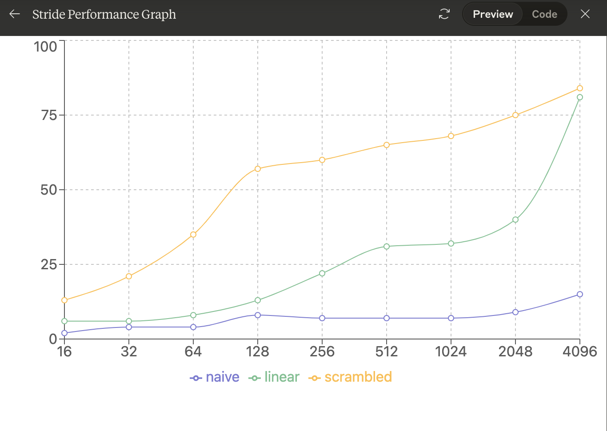
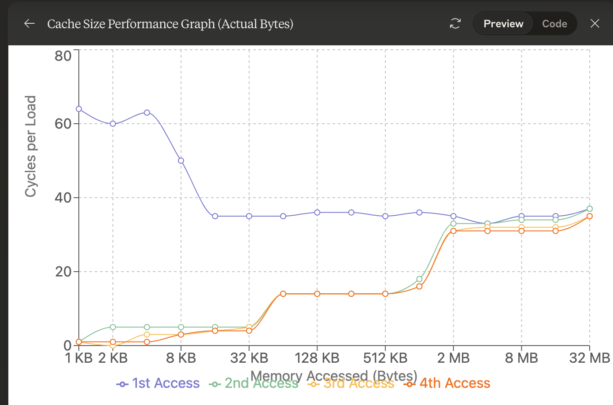
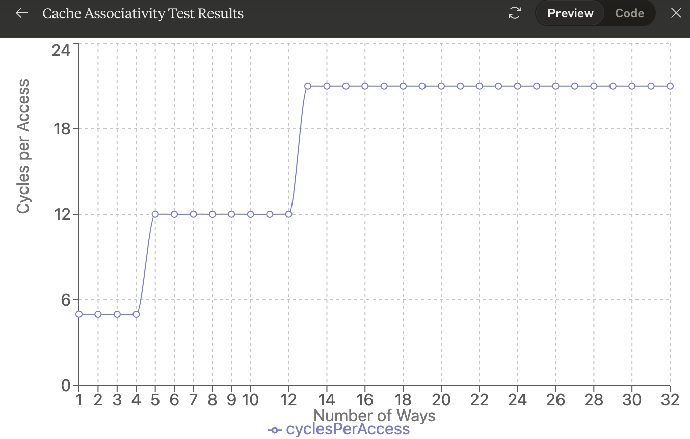
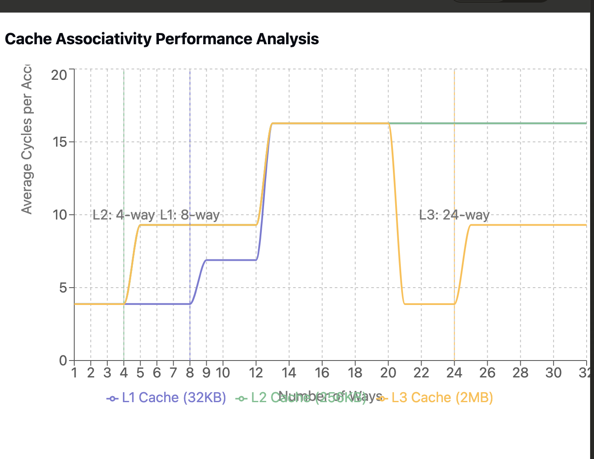
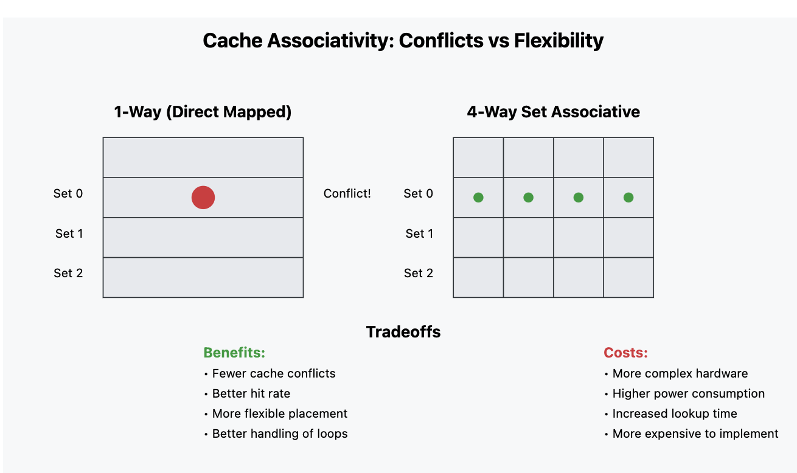

# caching

caches have the line and the associativity of each layer in cache

caches have total size


Running mystery2.cc

tride[16] naive 1 cy/ld, linear 3 cy/ld, scrambled 10 cy/ld
stride[32] naive 1 cy/ld, linear 4 cy/ld, scrambled 17 cy/ld
stride[64] naive 2 cy/ld, linear 6 cy/ld, scrambled 29 cy/ld
stride[128] naive 3 cy/ld, linear 9 cy/ld, scrambled 39 cy/ld
stride[256] naive 3 cy/ld, linear 10 cy/ld, scrambled 44 cy/ld
stride[512] naive 4 cy/ld, linear 8 cy/ld, scrambled 42 cy/ld
stride[1024] naive 4 cy/ld, linear 10 cy/ld, scrambled 46 cy/ld
stride[2048] naive 5 cy/ld, linear 10 cy/ld, scrambled 52 cy/ld
stride[4096] naive 7 cy/ld, linear 21 cy/ld, scrambled 57 cy/ld
lgcount[4][16] load N cache lines, giving cy/ld. Repeat.  2 2 2 2 
lgcount[5][32] load N cache lines, giving cy/ld. Repeat.  3 2 1 1 
lgcount[6][64] load N cache lines, giving cy/ld. Repeat.  17 1 1 1 
lgcount[7][128] load N cache lines, giving cy/ld. Repeat.  27 2 2 2 
lgcount[8][256] load N cache lines, giving cy/ld. Repeat.  19 2 2 2 
lgcount[9][512] load N cache lines, giving cy/ld. Repeat.  23 6 6 6 
lgcount[10][1024] load N cache lines, giving cy/ld. Repeat.  19 7 8 8 
lgcount[11][2048] load N cache lines, giving cy/ld. Repeat.  20 8 8 8 
lgcount[12][4096] load N cache lines, giving cy/ld. Repeat.  21 8 8 8 
lgcount[13][8192] load N cache lines, giving cy/ld. Repeat.  21 9 8 8 
lgcount[14][16384] load N cache lines, giving cy/ld. Repeat.  23 12 10 11 
lgcount[15][32768] load N cache lines, giving cy/ld. Repeat.  19 19 19 19 
lgcount[16][65536] load N cache lines, giving cy/ld. Repeat.  20 19 21 19 
lgcount[17][131072] load N cache lines, giving cy/ld. Repeat.  20 20 19 20 
lgcount[18][262144] load N cache lines, giving cy/ld. Repeat.  21 20 20 20 
lgcount[19][524288] load N cache lines, giving cy/ld. Repeat.  20 20 21 20 
FindCacheAssociativity(64, 32768) not implemented yet.
FindCacheAssociativity(64, 262144) not implemented yet.
FindCacheAssociativity(64, 2097152) not implemented yet.

Intel® Xeon® Platinum 8360Y Processor specs

stride[16] naive 2 cy/ld, linear 6 cy/ld, scrambled 13 cy/ld
stride[32] naive 4 cy/ld, linear 6 cy/ld, scrambled 21 cy/ld
stride[64] naive 4 cy/ld, linear 8 cy/ld, scrambled 35 cy/ld
stride[128] naive 8 cy/ld, linear 13 cy/ld, scrambled 57 cy/ld
stride[256] naive 7 cy/ld, linear 22 cy/ld, scrambled 60 cy/ld
stride[512] naive 7 cy/ld, linear 31 cy/ld, scrambled 65 cy/ld
stride[1024] naive 7 cy/ld, linear 32 cy/ld, scrambled 68 cy/ld
stride[2048] naive 9 cy/ld, linear 40 cy/ld, scrambled 75 cy/ld
stride[4096] naive 15 cy/ld, linear 81 cy/ld, scrambled 84 cy/ld
lgcount[4] load N cache lines, giving cy/ld. Repeat.  64 1 1 1 
lgcount[5] load N cache lines, giving cy/ld. Repeat.  60 5 0 1 
lgcount[6] load N cache lines, giving cy/ld. Repeat.  63 5 3 1 
lgcount[7] load N cache lines, giving cy/ld. Repeat.  50 5 3 3 
lgcount[8] load N cache lines, giving cy/ld. Repeat.  35 5 4 4 
lgcount[9] load N cache lines, giving cy/ld. Repeat.  35 5 5 4 
lgcount[10] load N cache lines, giving cy/ld. Repeat.  35 14 14 14 
lgcount[11] load N cache lines, giving cy/ld. Repeat.  36 14 14 14 
lgcount[12] load N cache lines, giving cy/ld. Repeat.  36 14 14 14 
lgcount[13] load N cache lines, giving cy/ld. Repeat.  35 14 14 14 
lgcount[14] load N cache lines, giving cy/ld. Repeat.  36 18 16 16 
lgcount[15] load N cache lines, giving cy/ld. Repeat.  35 33 31 31 
lgcount[16] load N cache lines, giving cy/ld. Repeat.  33 33 32 31 
lgcount[17] load N cache lines, giving cy/ld. Repeat.  35 34 32 31 
lgcount[18] load N cache lines, giving cy/ld. Repeat.  35 34 32 31 
lgcount[19] load N cache lines, giving cy/ld. Repeat.  37 37 35 35 
FindCacheAssociativity(64, 32768) not implemented yet.
FindCacheAssociativity(64, 262144) not implemented yet.
FindCacheAssociativity(64, 2097152) not implemented yet.

3.1

if you graph it, the cache stride seems to be 64. It bumps way up if you go past thst

3.2



wow it kind of matches what was before ~30, 80, 200
now it's 7, 22, 60, it's like 3x, 3x, 3x.

Hmmm, I guess that naive would prefetch, a linear linked list would have overhead of linked list and accessing pointer which idk about prefetching (still can load 4k into page) and then random hops over for scrambled. So like if you do linked list, it's going to be 3x and then random hops in memory is another 3x compared to flat array.

A good guess is 4x and 8x compared both

3.3
extra bit = 0;
stride[16] naive 2 cy/ld, linear 5 cy/ld, scrambled 13 cy/ld
stride[32] naive 4 cy/ld, linear 5 cy/ld, scrambled 19 cy/ld
stride[64] naive 6 cy/ld, linear 7 cy/ld, scrambled 30 cy/ld
stride[128] naive 8 cy/ld, linear 11 cy/ld, scrambled 43 cy/ld
stride[256] naive 8 cy/ld, linear 17 cy/ld, scrambled 48 cy/ld
stride[512] naive 9 cy/ld, linear 26 cy/ld, scrambled 52 cy/ld
stride[1024] naive 10 cy/ld, linear 26 cy/ld, scrambled 53 cy/ld
stride[2048] naive 12 cy/ld, linear 30 cy/ld, scrambled 59 cy/ld
stride[4096] naive 19 cy/ld, linear 67 cy/ld, scrambled 73 cy/ld
lgcount[4] load N cache lines, giving cy/ld. Repeat.  66 6 6 1 
lgcount[5] load N cache lines, giving cy/ld. Repeat.  55 5 5 5 
lgcount[6] load N cache lines, giving cy/ld. Repeat.  50 5 5 1 
lgcount[7] load N cache lines, giving cy/ld. Repeat.  41 5 5 3 
lgcount[8] load N cache lines, giving cy/ld. Repeat.  32 5 4 4 
lgcount[9] load N cache lines, giving cy/ld. Repeat.  32 5 5 4 
lgcount[10] load N cache lines, giving cy/ld. Repeat.  32 14 14 14 
lgcount[11] load N cache lines, giving cy/ld. Repeat.  33 13 13 13 
lgcount[12] load N cache lines, giving cy/ld. Repeat.  33 14 14 14 
lgcount[13] load N cache lines, giving cy/ld. Repeat.  33 14 14 14 
lgcount[14] load N cache lines, giving cy/ld. Repeat.  34 19 16 16 
lgcount[15] load N cache lines, giving cy/ld. Repeat.  34 32 31 32 
lgcount[16] load N cache lines, giving cy/ld. Repeat.  33 32 31 31 
lgcount[17] load N cache lines, giving cy/ld. Repeat.  34 33 32 32 
lgcount[18] load N cache lines, giving cy/ld. Repeat.  34 33 32 31 
lgcount[19] load N cache lines, giving cy/ld. Repeat.  35 35 33 33 

it's much better, why is not the same as linear? cause random next element.

128 bytes 43 vs 57. wow almost 20%. Yeah mappings matter. Don't hop everwhere.

3.4


This is scrambled loads (random linked list access).

L1 32KB, since it bumps before that
L2 512KB, bump
L3 > 32MB.

Side note:
I think you should ignore the first access for 16 < KB. I think every first access is ~35 cycles.
The L1 access goes from 4 to L2 14 to L3 32

3.5
load to use -> 4 -> 14 -> 32, 4x, 2x again?

3.6
i3 3MB MB would need anything > 1M to be steps of 1MB

3.7
Maybe the kernel needs to have some cache? We don't use all of the cache :)

Here's the actual specs

Cache L1:	64 KB (per core), Wrong, I was 32KB, makes sense
Cache L2:	1 MB (per core), Wrong, I was 512KB, makes sense
Cache L3:	54 MB (shared), I guessed roughly

3.8

```c
void FindCacheAssociativity(uint8 *ptr, int kMaxArraySize, int linesize, int totalsize)
{
  int num_sets = totalsize / linesize; // Number of cache sets
  int max_ways = 32;                   // Test up to 32-way associativity

  fprintf(stdout, "\nTesting cache associativity:\n");
  fprintf(stdout, "Cache size: %d bytes\n", totalsize);
  fprintf(stdout, "Line size: %d bytes\n", linesize);
  fprintf(stdout, "Number of sets: %d\n\n", num_sets);

  // We'll test different numbers of ways to find when thrashing occurs
  for (int ways = 1; ways <= max_ways; ways++)
  {
    // Create a circular linked list that accesses 'ways' number of addresses
    // that all map to the same cache set
    Pair *start = reinterpret_cast<Pair *>(ptr);
    Pair *current = start;

    // Create the linked list
    for (int i = 0; i < ways; i++)
    {
      // Calculate offset to next address that maps to same cache set
      // We use num_sets * linesize to skip to next possible conflicting address
      int offset = (i * num_sets * linesize) % kMaxArraySize;
      current->next = reinterpret_cast<Pair *>(ptr + offset);
      current = current->next;
    }
    // Make it circular by pointing last element back to start
    current->next = start;

    // Clear the caches before measurement
    TrashTheCaches(ptr, kMaxArraySize);

    // Measure access time for this number of ways
    // We'll do many iterations to get a stable measurement
    const int num_iterations = 1000000;
    current = start;

    int64 start_time = GetCycles();

    // Access the linked list repeatedly
    for (int i = 0; i < num_iterations; i++)
    {
      current = current->next;
    }

    int64 end_time = GetCycles();

    // Calculate average cycles per access
    double cycles_per_access = static_cast<double>(end_time - start_time) / num_iterations;

    fprintf(stdout, "Ways: %2d, Average cycles per access: %.2f\n",
            ways, cycles_per_access);

    // Make current pointer live so compiler doesn't optimize away the loop
    if (gNeverZero == 0)
    {
      fprintf(stdout, "current = %p\n", current);
    }

    // Optional: Detect significant performance drop
    static double last_cycles = 0;
    if (last_cycles > 0)
    {
      double increase = cycles_per_access / last_cycles;
      if (increase > 1.5)
      { // Performance degraded by >50%
        fprintf(stdout, "*** Significant slowdown detected at %d ways ***\n", ways);
        fprintf(stdout, "This suggests %d-way set associativity\n", ways - 1);
      }
    }
    last_cycles = cycles_per_access;
  }
}
```




Testing cache associativity:
Cache size: 32768 bytes
Line size: 64 bytes
Number of sets: 512

Ways:  1, Average cycles per access: 3.88
Ways:  2, Average cycles per access: 3.88
Ways:  3, Average cycles per access: 3.88
Ways:  4, Average cycles per access: 3.88
Ways:  5, Average cycles per access: 3.87
Ways:  6, Average cycles per access: 3.87
Ways:  7, Average cycles per access: 3.87
Ways:  8, Average cycles per access: 3.87
Ways:  9, Average cycles per access: 6.89
*** Significant slowdown detected at 9 ways ***
This suggests 8-way set associativity
Ways: 10, Average cycles per access: 9.30
Ways: 11, Average cycles per access: 9.30
Ways: 12, Average cycles per access: 9.30
Ways: 13, Average cycles per access: 16.27
*** Significant slowdown detected at 13 ways ***
This suggests 12-way set associativity
Ways: 14, Average cycles per access: 16.27
Ways: 15, Average cycles per access: 16.27
Ways: 16, Average cycles per access: 16.27
Ways: 17, Average cycles per access: 16.27
Ways: 18, Average cycles per access: 16.27
Ways: 19, Average cycles per access: 16.27
Ways: 20, Average cycles per access: 16.27
Ways: 21, Average cycles per access: 16.27
Ways: 22, Average cycles per access: 16.27
Ways: 23, Average cycles per access: 16.27
Ways: 24, Average cycles per access: 16.27
Ways: 25, Average cycles per access: 16.28
Ways: 26, Average cycles per access: 16.27
Ways: 27, Average cycles per access: 16.27
Ways: 28, Average cycles per access: 16.27
Ways: 29, Average cycles per access: 16.27
Ways: 30, Average cycles per access: 16.27
Ways: 31, Average cycles per access: 16.26
Ways: 32, Average cycles per access: 16.27

Testing cache associativity:
Cache size: 262144 bytes
Line size: 64 bytes
Number of sets: 4096

Ways:  1, Average cycles per access: 3.88
Ways:  2, Average cycles per access: 3.88
Ways:  3, Average cycles per access: 3.88
Ways:  4, Average cycles per access: 3.88
Ways:  5, Average cycles per access: 9.30
*** Significant slowdown detected at 5 ways ***
This suggests 4-way set associativity
Ways:  6, Average cycles per access: 9.30
Ways:  7, Average cycles per access: 9.30
Ways:  8, Average cycles per access: 9.30
Ways:  9, Average cycles per access: 9.30
Ways: 10, Average cycles per access: 9.30
Ways: 11, Average cycles per access: 9.30
Ways: 12, Average cycles per access: 9.30
Ways: 13, Average cycles per access: 16.26
*** Significant slowdown detected at 13 ways ***
This suggests 12-way set associativity
Ways: 14, Average cycles per access: 16.27
Ways: 15, Average cycles per access: 16.27
Ways: 16, Average cycles per access: 16.27
Ways: 17, Average cycles per access: 16.27
Ways: 18, Average cycles per access: 16.27
Ways: 19, Average cycles per access: 16.27
Ways: 20, Average cycles per access: 16.27
Ways: 21, Average cycles per access: 16.27
Ways: 22, Average cycles per access: 16.27
Ways: 23, Average cycles per access: 16.27
Ways: 24, Average cycles per access: 16.27
Ways: 25, Average cycles per access: 16.27
Ways: 26, Average cycles per access: 16.27
Ways: 27, Average cycles per access: 16.27
Ways: 28, Average cycles per access: 16.27
Ways: 29, Average cycles per access: 16.27
Ways: 30, Average cycles per access: 16.27
Ways: 31, Average cycles per access: 16.27
Ways: 32, Average cycles per access: 16.27

Testing cache associativity:
Cache size: 2097152 bytes
Line size: 64 bytes
Number of sets: 32768

Ways:  1, Average cycles per access: 3.87
Ways:  2, Average cycles per access: 3.87
Ways:  3, Average cycles per access: 3.87
Ways:  4, Average cycles per access: 3.87
Ways:  5, Average cycles per access: 9.30
*** Significant slowdown detected at 5 ways ***
This suggests 4-way set associativity
Ways:  6, Average cycles per access: 9.30
Ways:  7, Average cycles per access: 9.30
Ways:  8, Average cycles per access: 9.30
Ways:  9, Average cycles per access: 9.30
Ways: 10, Average cycles per access: 9.30
Ways: 11, Average cycles per access: 9.30
Ways: 12, Average cycles per access: 9.30
Ways: 13, Average cycles per access: 16.27
*** Significant slowdown detected at 13 ways ***
This suggests 12-way set associativity
Ways: 14, Average cycles per access: 16.27
Ways: 15, Average cycles per access: 16.27
Ways: 16, Average cycles per access: 16.27
Ways: 17, Average cycles per access: 16.27
Ways: 18, Average cycles per access: 16.27
Ways: 19, Average cycles per access: 16.27
Ways: 20, Average cycles per access: 16.27
Ways: 21, Average cycles per access: 3.87
Ways: 22, Average cycles per access: 3.87
Ways: 23, Average cycles per access: 3.87
Ways: 24, Average cycles per access: 3.88
Ways: 25, Average cycles per access: 9.30
*** Significant slowdown detected at 25 ways ***
This suggests 24-way set associativity
Ways: 26, Average cycles per access: 9.30
Ways: 27, Average cycles per access: 9.30
Ways: 28, Average cycles per access: 9.30
Ways: 29, Average cycles per access: 9.30
Ways: 30, Average cycles per access: 9.30
Ways: 31, Average cycles per access: 9.30
Ways: 32, Average cycles per access: 9.30

So TLDR
Find cache line is essentially
Flat array, stride by stride what is the cycles per 2, 4, 8 byte load

Find cache size is basically
Access memory within a certain array, and keep increasing that array until it has bad number

Find cache associativity is basically
You know L1 cache size, so you know the sets = cache size / line size, so you iterate over multiple of L1 cache size to hit same sets until set is full and evicts.

hitting L1 vs L2 is 4x decrease and hitting l1 vs l3 is 4x decrease


Why increase/decrease cache associativity?



