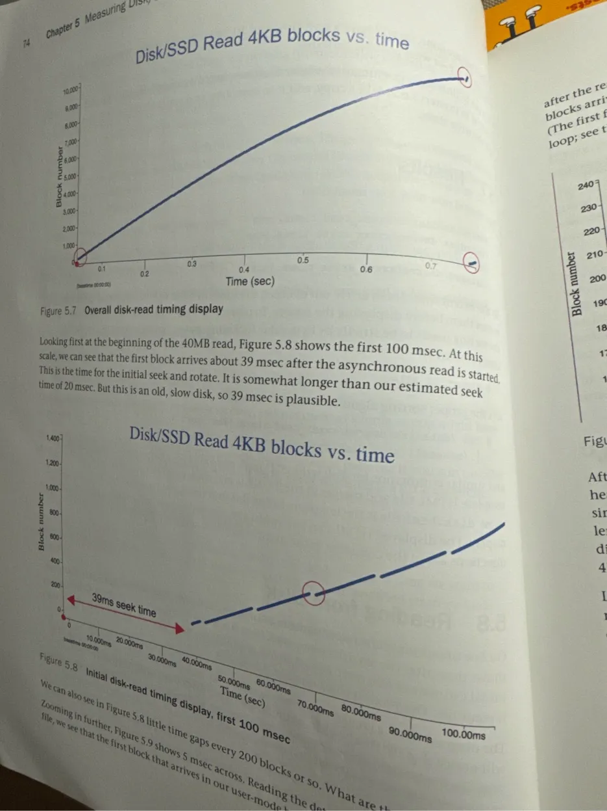
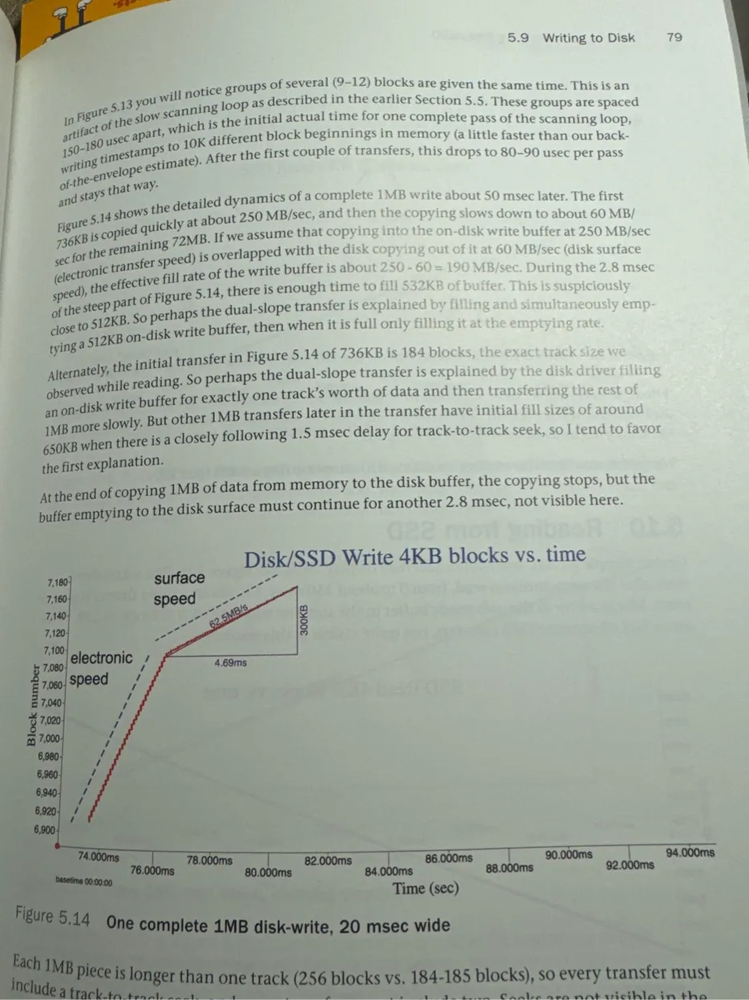
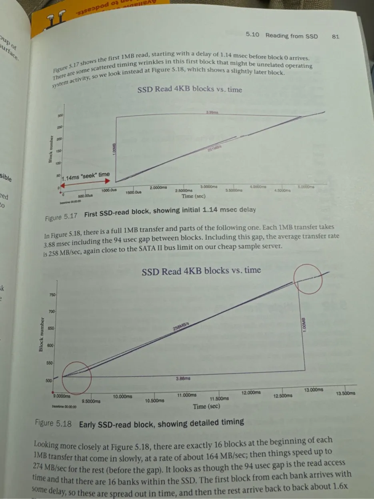
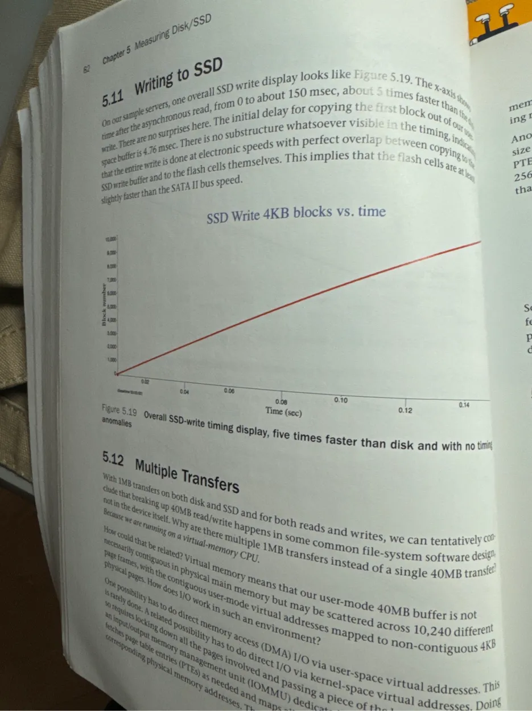
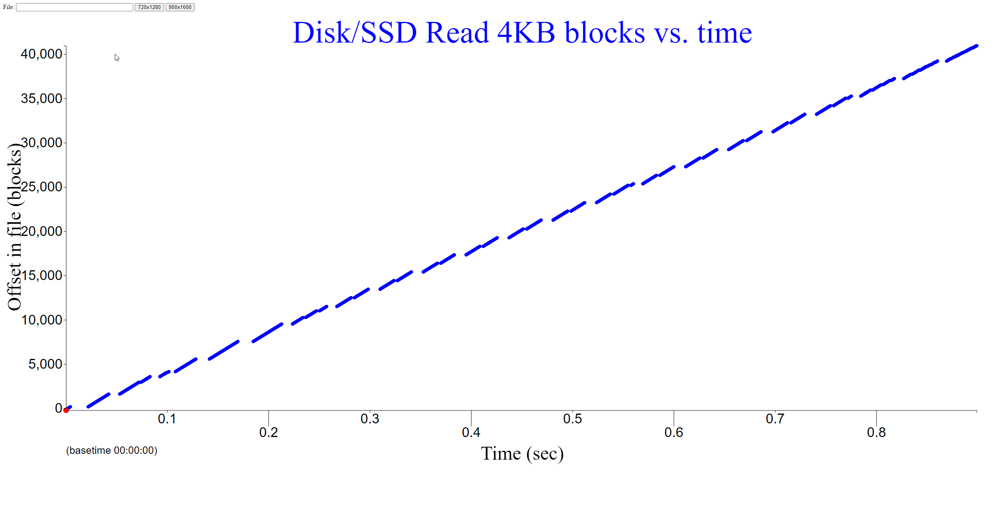
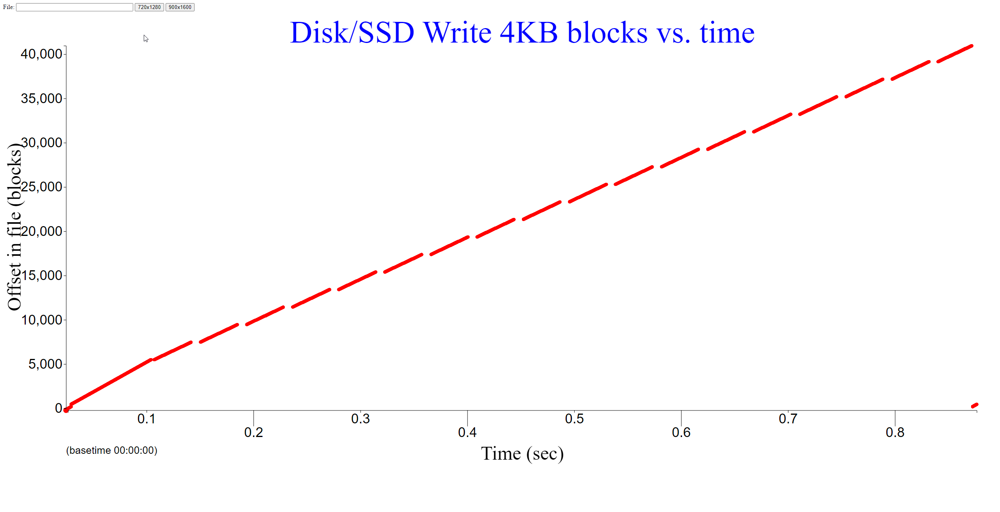
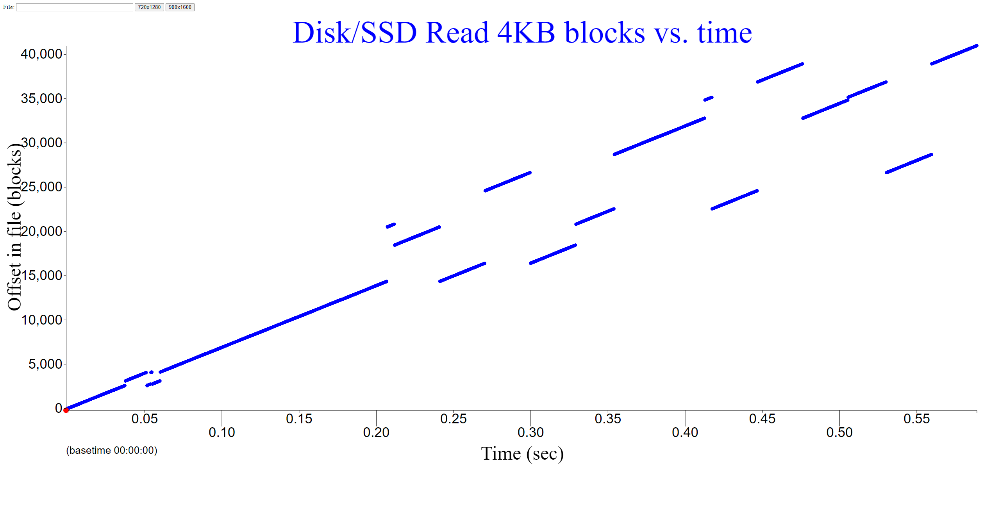
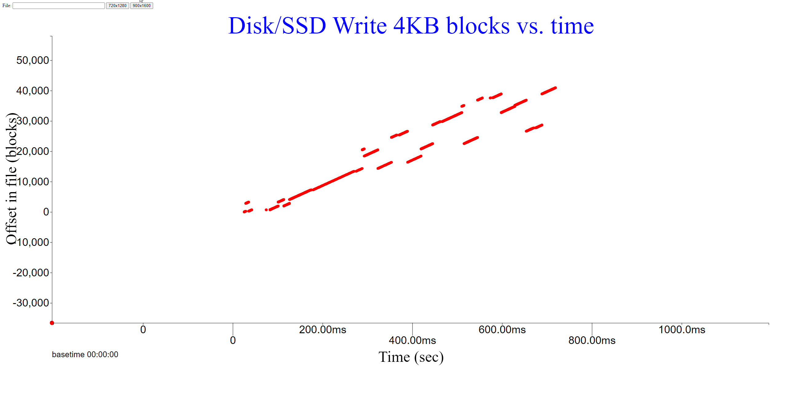
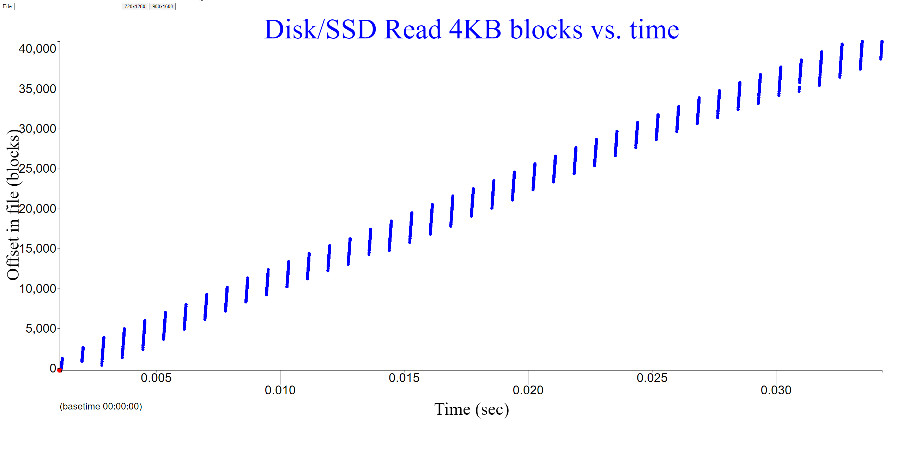
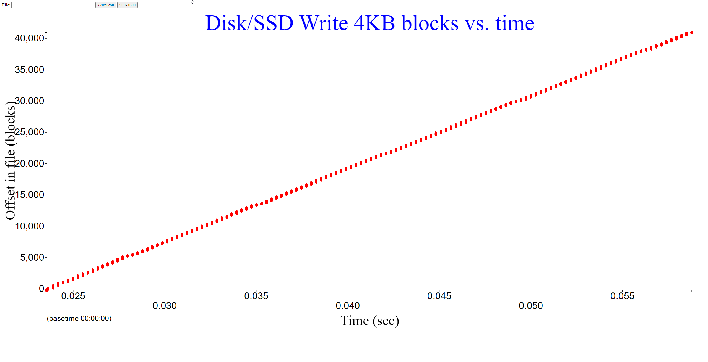

# Notes while reading

Disk has tracks and sectors, higher number of sectors in outer tracks
seek is 4-15ms = 7200rpm / 60 = 120 revolutions in one second = 1 / 120 = 8.3ms per one revolution

SSDs have drain/charge, so put a V12 to force electrons out. Erasing means the block must be cleared before writing (set all bits to 1), 4K. And then selective writing sets it to 0s.

Reading SSD is around 100us - 1000x slower than DRAM (1ns), but 100x faster than harddrive. (10ms)
Erasing on SSD is 10ms, writing is 1ms
SSDs may compress data before storing it and decompress on reading
bits can be 8 different charges per 3 bits, 4 for 2 and 2 for 1

Software
Write buffer and read ahead - basically 2 operations in parallel only is done serially if disabled
If reading 2 blocks of 64K, only one block is read before second is done
If writing 2 blocks, only first is done.
Basically less stuff from software to send commands. Can buffer commands into one
Intermixing reads and writes bad. Why? The read has to wait for writes to be done. Say 10x writes for 1MB -> 400ms overhead before reads happen.
Can overlap, but write buffer will get full.

SSDs erase lock out the device (being 10ms erase + 1ms for writes), so reads take 100us, but now take 10ms.

Seek Time: 8-12ms average for modern drives
This is the time it takes for the head to move to the correct track

Rotational Latency:
5400 RPM: Average ~5.5ms (half rotation)
7200 RPM: Average ~4.2ms (half rotation)

Transfer Time for 4KB:
5400 RPM: ~0.2ms (assuming ~40MB/s minimum transfer rate)
7200 RPM: ~0.15ms (assuming ~50MB/s minimum transfer rate)

Reading blocks



Real blocks reads act differently!



Electronic Speed (Steeper Slope):
Initial transfer rate of about 250 MB/sec
This represents data being copied from memory into the disk's write buffer
Shows as a steeper slope in the first part of the graph
This is purely electronic transfer, hence the faster rate

Surface Speed (Shallower Slope):
Slower rate of about 60 MB/sec
This represents the actual physical writing to the disk surface
Shows as a more gradual slope
Limited by the physical rotation speed and density of the disk

Emptying buffer to disk at 62.6 MB/s
The buffer acts as a reservoir between these two speeds

SSDs



1.1ms seek time

There's an interesting pattern at the start of each 1MB transfer:

The average transfer rate is 258 MB/sec (limited by SATA II bus)

First 16 blocks come in slowly (164 MB/sec)
Then speed increases to 274 MB/sec for remaining blocks
A 94μs gap follows each transfer

Bank 1  [Block 1]-->[More Blocks]-->
Bank 2     [Block 2]-->[More Blocks]-->
Bank 3        [Block 3]-->[More Blocks]-->
...and so on...

The SSD in this example has 16 banks
Each bank is an independent unit that can read/write independently
Banks allow parallel operations to increase throughput




Memory Path Issues:

User-mode 40MB buffer isn't necessarily contiguous in physical memory
It's scattered across 10,240 different 4KB pages
Virtual addresses don't map directly to contiguous physical memory
Pages might be spread out in physical memory

I/O Transfer Path:

CopyUser Space Virtual Memory
      ↓ [MMU translation]
Physical Memory
      ↓ [DMA]
I/O Device Buffer

Two Possible Ways to Handle I/O:

Direct Memory Access (DMA):
Direct I/O via user-space virtual addresses
Requires kernel space translation
Needs MMU to map virtual to physical addresses

Kernel Buffer Method:
Copy from user space → kernel buffer
Then DMA from kernel buffer → device
Double-copy but simpler management

Why 1MB Transfers Instead of 40MB:
Breaking into smaller chunks helps manage:

Page table entries (PTEs)
Memory management complexity
DMA buffer sizes
Hardware table limitations
Cache efficiency

This explains why we see 1MB transfer sizes - it's a compromise between efficiency and system memory management complexity, particularly when dealing with virtual memory and DMA operations.

## Ask why and what along the way

```
rm /mnt/disk1/KUtrace/bookcode/test_read_times.json
rm /mnt/disk1/KUtrace/bookcode/test_write_times.json

rm -rf /mnt/disk2/mystery3_test
./mystery3_opt /mnt/disk2/mystery3_test

mv /mnt/disk2/mystery3_test_read_times.json harddisk_read_times.json
mv /mnt/disk2/mystery3_test_write_times.json harddisk_write_times.json

rm -rf /mnt/disk2/mystery3_test*

export LC_ALL=C
cat harddisk_read_times.json | sort | ./makeself show_disk.html > harddisk_read.html
cat harddisk_write_times.json | sort | ./makeself show_disk.html > harddisk_write.html


SSD


./mystery3_opt /home/maknee/mystery3_test

mv /home/maknee/mystery3_test_read_times.json sata_ssd_read_times.json
mv /home/maknee/mystery3_test_write_times.json sata_ssd_write_times.json

rm -rf /home/maknee/mystery3_test*

export LC_ALL=C
cat sata_ssd_read_times.json | sort | ./makeself show_disk.html > sata_ssd_read.html
cat sata_ssd_write_times.json | sort | ./makeself show_disk.html > sata_ssd_write.html


NVME

./mystery3_opt /4nvme/mystery3_test

mv /4nvme/mystery3_test_read_times.json nvme_ssd_read_times.json
mv /4nvme/mystery3_test_write_times.json nvme_ssd_write_times.json

rm -rf /home/maknee/mystery3_test*

export LC_ALL=C
cat nvme_ssd_read_times.json | sort | ./makeself show_disk.html > nvme_ssd_read.html
cat nvme_ssd_write_times.json | sort | ./makeself show_disk.html > nvme_ssd_write.html


```

# Questions

5.1 What causes groups of about 150-250 disk blocks with time gaps between? About what is the time between groups? What is causing this delay?


[0.341124, 15401],
[0.352807, 15402],
11.7ms

[0.366860, 16391],
[0.370093, 16392],
3.2ms

990 blocks
+
946 blocks
=
1936 blocks

[0.383525, 17337],
[0.395127, 17338],
11.7ms


Swapping track + seeking, although, it's quick (3.2ms)

5.2 Extra credit: If some groups are one block shorter than others, why?

No idea

5.3 In the JSON file, find the smallest transfer time (which may not be at the front). What is the seek and rotate time to get to the very first block read, in milliseconds?

275MB/s, 11.7ms

5.4 Find the largest transfer time, and divide it by the 40MB transferred. What is the overall transfer rate observed, in MB/sec? (This includes the initial seek and all intermediate delays so is somewhat lower than any marketing number.)

179ms

5.5 Looking at a typical group of ~200 blocks with time gaps on both sides, what is the overall transfer rate within that group, in MB/sec? This should be the true transfer rate at the read/write head.
5.6 Look around for a group that has a faster transfer rate than the disk surface supports. What is the fast transfer rate, in MB/sec? What is going on when that happens?

Not for my hardisks

5.7 Now run mystery3 on an SSD using /datasssd/dserve. What is the seek time to read the soonest-delivered block? What is the overall transfer rate start to finish, in MB/sec?

like 500us, rate is 272MB/s

5.8 The SSD timings probably have a different pattern than the disk timings, with perhaps very regular discontinuities or changes in rate. How many discontinuities are there? Comment briefly on what you think is happening.

There are many discontinuties, probably due to how each block is scheduled and where it has to be placed on the SSD? Not sure, maybe some mapping and for writes, it has to remove the block bewrite writing

5.9 Complete the missing part of TimeDiskWrite(). Mine is seven more lines, setting the block current times. This will be easy if you have followed what the strategy is, and a bit harder if you have been only skimming this text and the code. But when you are done, you will better understand what is going on.

5.10 Now re-run on disk and look at the disk write timings. Are you surprised? You might see a lot of discontinuities. How many discontinuities or big rate groups are there? Comment briefly on what you think is happening.

Perfect with ~ 8MB per block and ~8ms per seek

5.11 Finally, re-run on an SSD and look at the SSD write timings and comment briefly on what you think is happening. Use your order-of-magnitude knowledge to compare various time delays to possible causes. If the delay from a possible cause is a different order of magnitude than the observed delay, move on to another possibility.

no clue for ssd, the graph is ridicious? Maybe I'm running the workload on the same drive as running on OS, so it might affect the outcome?

nvme -  hardware polling interval every ~750us, for writes, ~275us, but blocks read/written is different (12.8MB verus 1.28MB)










[0.341124, 15401],
[0.352807, 15402],
11.7ms


[0.366860, 16391],
[0.370093, 16392],
3.2ms

990 blocks
+
946 blocks
=
1936 blocks = 8MB?

[0.383525, 17337],
[0.395127, 17338],
11.7ms


Writes

[0.141543,  7473],
[0.150505,  7474],

1980 blocks ~ 8MB

[0.184806,  9453],
[0.193784,  9454],


