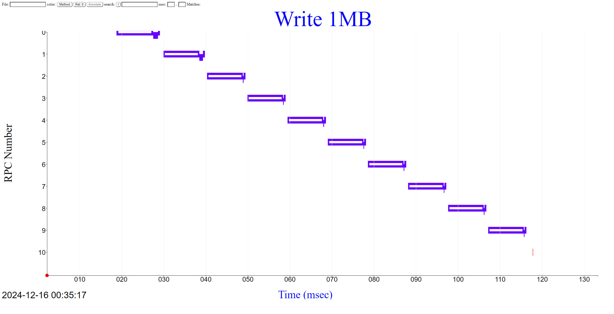
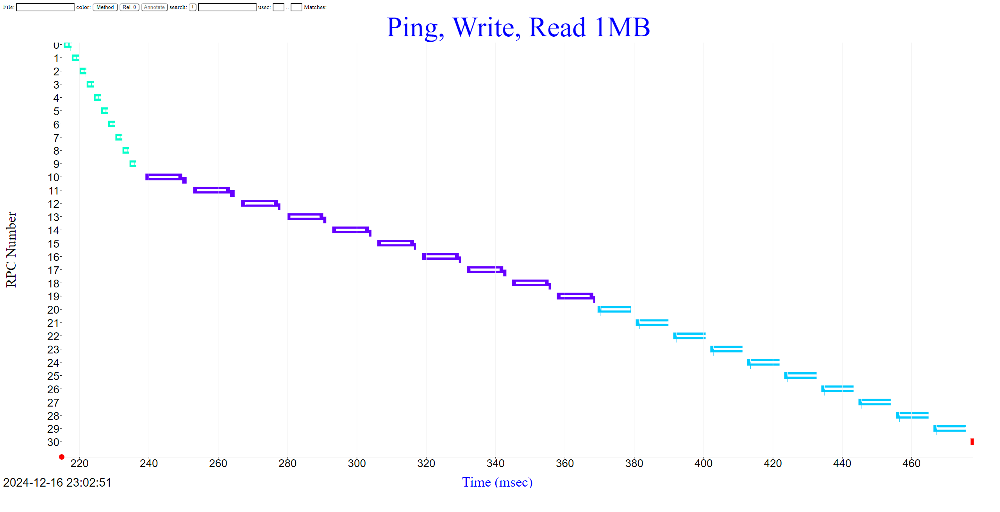

# Notes while reading

~10Gb/s = 125 MB/s

We want to have slop, which is defined as

T1 (client -> server)
T2 (server got client req)
T3 (server sent out resp)
T4 (client got response)

## Ask why and what along the way

# Questions
Exercises
Consider this work:

Send 10 ping messages of 100KB each.
Send 10 writes of 1MB of random data for keys kkkkk, kkkkl, kkkkm, ..., kkkkt.
Send 10 matching reads of 1MB from the same 10 keys.
Finally, send a quit command.

Ping 

Ping acks back with same data, so 2x

100MB/s / .1MB * 2 = 1ms * 2 = 2ms * 10 = 20ms

Writes

1MB / 100MB = 10ms send + (10GB / 1MB = 100us) memory + 100 bytes + 1us = ~10.1ms * 10 = 101ms

Reads

Same as writes, but opposite, so 101ms

Total = ~222ms

Draw yourself a little sketch of what you expect to see in the RPC timings.
Now run the server4 program on one sample server and the client4 program on another, sequentially sending commands for the previous sequences. Run the dumplogfile4 program and makeself program against the first three client log files and display the actual results.

You likely will find that the two servers' wall-clock times differ by a few milliseconds, which may be enough to make the HTML display look odd, if the send time for a message is timestamped after the receipt time. We will look at time alignment in the next chapter. In the meantime, you might consider hand-editing the JSON files to adjust T2 and T3 to be between T1 and T4. This is optional, but doing so will give you some insight about what your Chapter 7 program will need to do.

rm -rf client4_2024*
./client4 192.168.50.233 12345 -rep 10 ping -value "vvvvv" $((100 * 1024))

keys=( kkkkk kkkkl kkkkm kkkkn kkkko kkkkp kkkkq kkkkr kkkks kkkkt )
for key in "${keys[@]}"; do
    ./client4 192.168.50.233 12345 -rep 1 write -key "$key" -value "vvvvv" $((1024 * 1024))
done

for key in "${keys[@]}"; do
    ./client4 192.168.50.233 12345 -rep 1 read -key "$key"
done

./client4 192.168.50.233 12345 quit
./dumplogfile4 "Ping, Write, Read 1MB" client4_2024* > client4.json
./makeself show_rpc.html client4.json client_ping_write_read.html

~total is 260ms

6.1 How long, in milliseconds, did you estimate for the ping requests and their response message transmissions? How long do they actually take? Briefly comment on the difference.

Estimate was 2ms per

Breakdown 

[C -> S] 1.776ms
[S -> S] 16us
[S -> C] 269us

Total:
2.061ms

On track!

6.2 How long, in milliseconds, did you estimate for the write requests and their response message transmissions? How long do they actually take? Briefly comment on the difference.

Estimate was 10.1ms

Breakdown 

[C -> S] 10.532ms
[S -> S] 870us
[S -> C] ?

Total:
11.4ms

Off by 1.3ms. Maybe If I do 125MB as the measurement, it would be closer...

1MB / 125 = 0.008 = 8ms? f

Not sure, maybe it's cause of starting up the connection? Because it has to start handshake as well?

6.3 How long, in milliseconds, did you estimate for the read requests and their response message transmissions? How long do they actually take? Briefly comment on the difference.

Estimate was 10.1ms

Breakdown 

[C -> S] 928us
[S -> S] 136us
[S -> C] 8.3ms

Total:
9.36ms

Wonder why reads are faster? Maybe cause handshake with big value is bad!

