# Notes while reading

Sometimes clocks drift

So that T1, T2, T3, T4

T1 = client
T2 = server
T3 = server
T4 = client

The server may have eariler time

We want to find this delta such that T1 and T2 + T3 and T4 are aligned

This drift is defined as slop = (T4 - T1) - (T3 - T2) - requestTx - responseTx, which removes everything besides what's behind worked on server and being sent

Running with multiple clients on server, also if has lock, well other clients wait

If has disk, other clients wait even more

## Ask why and what along the way

# Questions

./server4

rm -rf client4_2024*
./client4 192.168.50.233 12345 -k 1000 -seed1 write -key "aaaa" + -value "valueaaa_0000" + 1000000 &
./client4 192.168.50.233 12346 -k 1000 -seed1 write -key "bbbb" + -value "valuebbb_0000" + 1000000 &
./client4 192.168.50.233 12347 -k 200 -seed1 write -key "cccc" + -value "valueccc_0000" + 1000000 &
./client4 192.168.50.233 12348 -k 200 -seed1 write -key "dddd" + -value "valueddd_0000" + 1000000

./client4 192.168.50.233 12345 quit

./timealign client4_2024*
./dumplogfile4 "Experiment 1 - 4 clients contention server" client4_2024*_align.log > ch7_exp1.json
./dumplogfile4 "Experiment 1 - 4 clients contention server" client4_2024* > ch7_exp1.json

export LC_ALL=C
cat ch7_exp1.json | sort | ./makeself show_rpc.html > ch7_exp1.html

./server_disk /mnt/disk1/KUtrace/bookcode/tmp 12345 4 -verbose -wait 5

rm -rf client4_2024*
./client4 192.168.50.233 12345 -k 1000 -seed1 write -key "aaaa" + -value "valueaaa_0000" + 1000000 &
./client4 192.168.50.233 12347 -k 200 -seed1 write -key "cccc" + -value "valueccc_0000" + 1000000 &
./client4 192.168.50.233 12348 -k 200 -seed1 write -key "dddd" + -value "valueddd_0000" + 1000000

./client4 192.168.50.233 12345 quit

./timealign client4_2024*
./dumplogfile4 "Experiment 2 - 3 clients contention disk server" client4_2024*_align.log > ch7_exp2.json
export LC_ALL=C
cat ch7_exp2.json | sort | ./makeself show_rpc.html > ch7_exp2.html

./server_disk /mnt/disk1/KUtrace/bookcode/tmp 12345 4 -verbose -wait 5

rm -rf client4_2024*
./client4 192.168.50.233 12346 -k 1000 -seed1 chksum -key "aaaa" &
./client4 192.168.50.233 12347 -k 200 -seed1 chksum -key "cccc" &
./client4 192.168.50.233 12348 -k 200 -seed1 chksum -key "dddd"

./client4 192.168.50.233 12345 quit

./timealign client4_2024*
./dumplogfile4 "Experiment 3 - 3 clients contention chksum disk server" client4_2024*_align.log > ch7_exp3.json
export LC_ALL=C
cat ch7_exp3.json | sort | ./makeself show_rpc.html > ch7_exp3.html

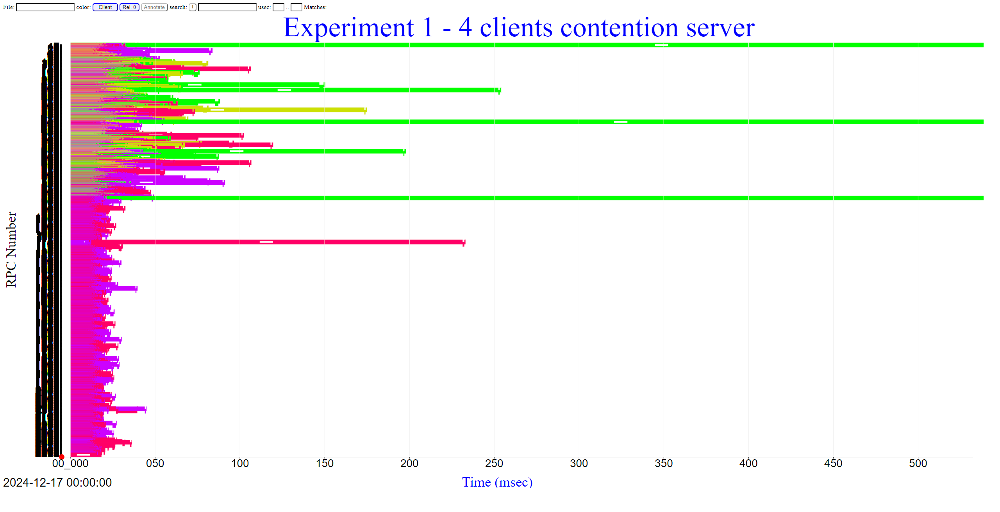
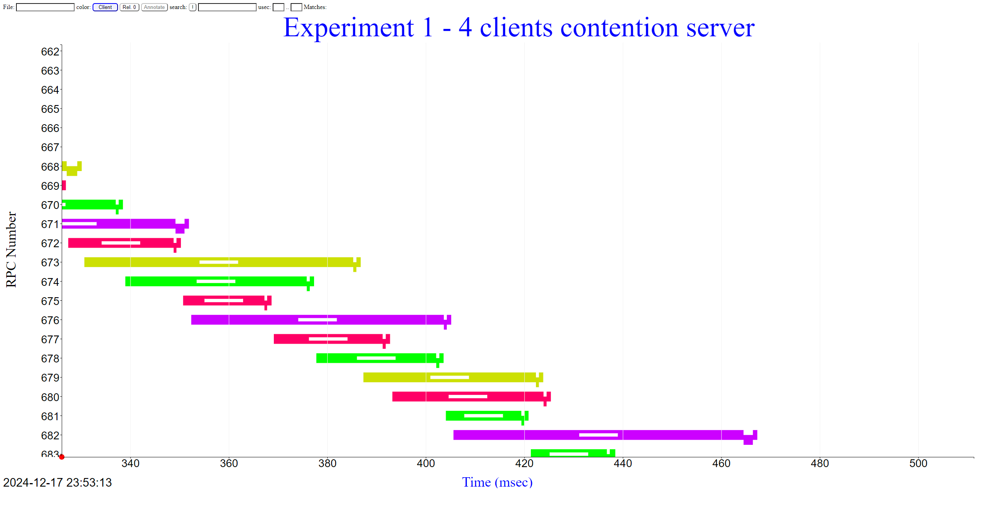

This shows the spinlock happening on red, waiting for yellow to finish

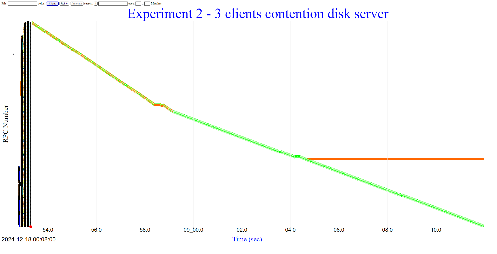

This is base image

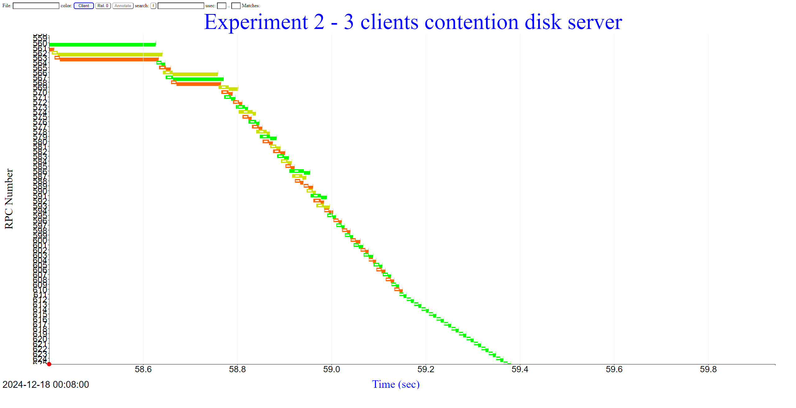

When going from 3 -> 1 clients, 25ms -> 15ms

8ms to transfer, 5ms wait before response. 2ms to put into memory

Remember disk seek ~ 10 - 15ms already

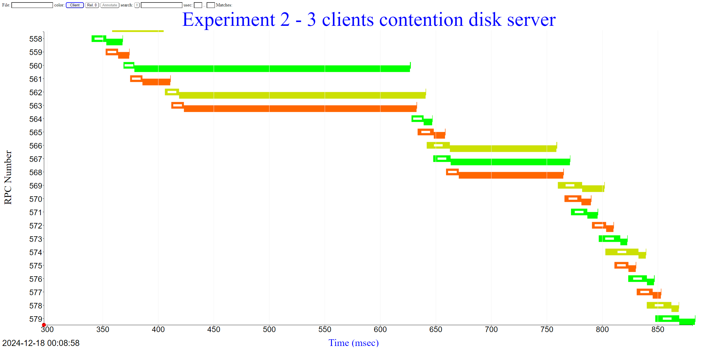

This becomes like 200ms or 90ms! What? Flush to disk?

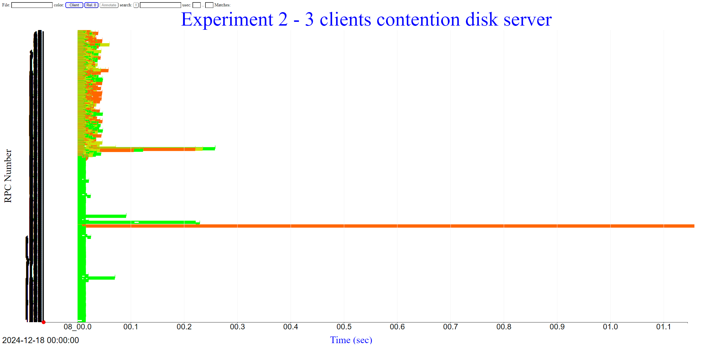

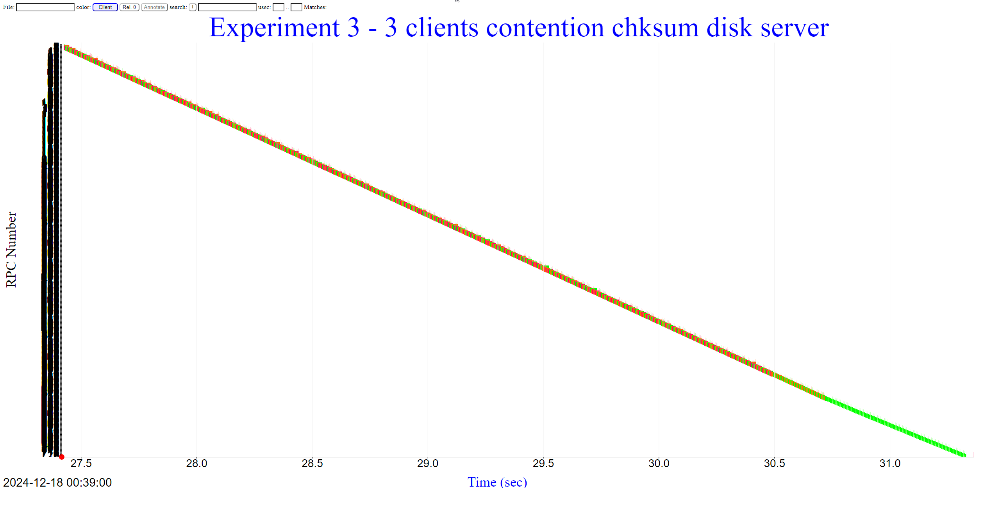

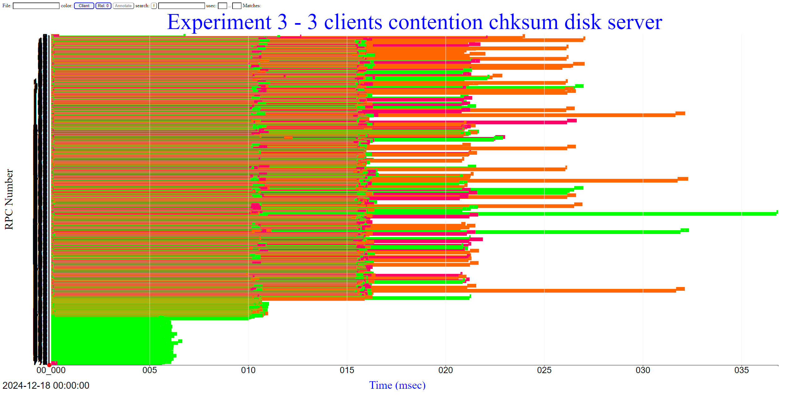
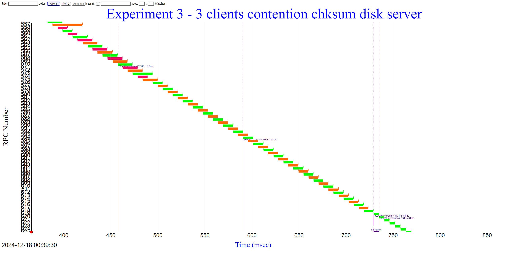

From RAM and from disk we observe, 15ms -> 10ms -> 5ms, from 3 to 1, mostly spent in waiting to hear back?

./server_disk /mnt/disk1/KUtrace/bookcode/tmp 12345 4 -verbose -wait 5

rm -rf client4_2024*
./client4 192.168.50.233 12346 -k 1000 -seed1 chksum -key "aaaa" &
./client4 192.168.50.233 12347 -k 200 -seed1 chksum -key "cccc" &
./client4 192.168.50.233 12348 -k 200 -seed1 chksum -key "dddd"

./client4 192.168.50.233 12345 quit

./timealign client4_2024*
./dumplogfile4 "Experiment 4 - 3 clients contention chksum disk server, O_DIRECT" client4_2024*_align.log > ch7_exp4.json
export LC_ALL=C
cat ch7_exp4.json | sort | ./makeself show_rpc.html > ch7_exp4.html

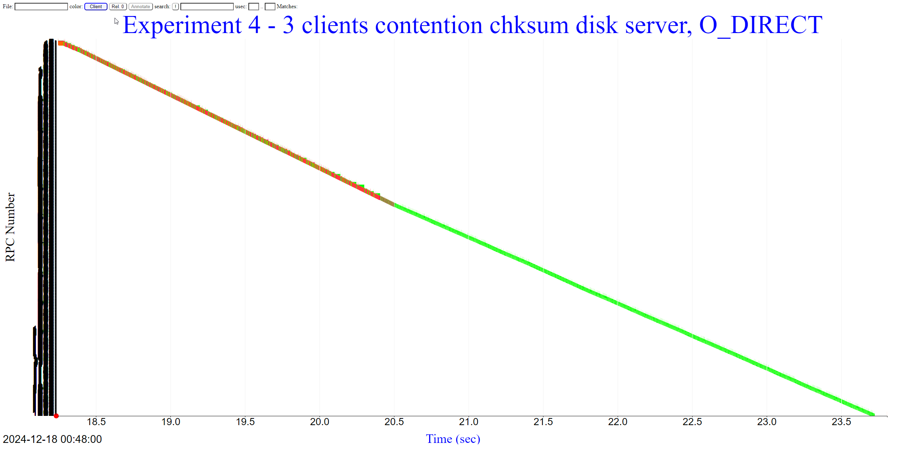
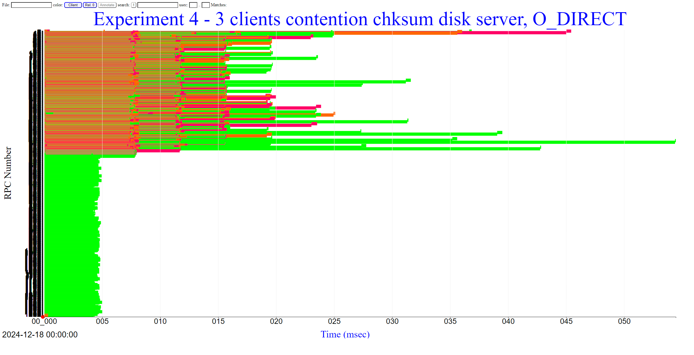
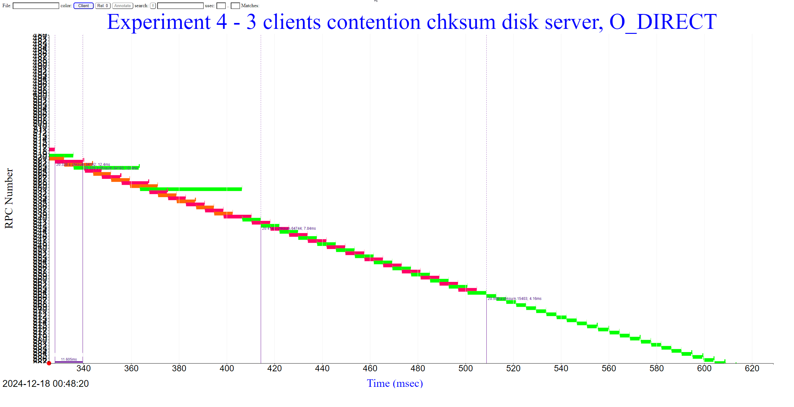

same thing, but from 12ms -> 10ms -> 5ms. Why are greens like 40ms?

reds are like 11ms? Make sense, 8ms + 1MB (200MB/s ~ 5ms)
